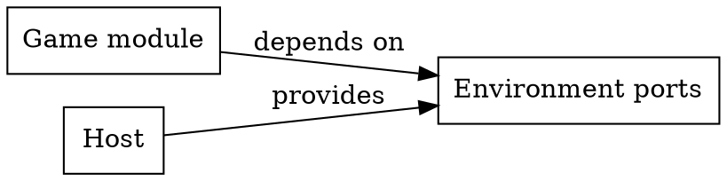

# Graphviz / DOT

Use DOT when the project chose it or a graph is extracted from code and its layout algorithm matters. Selection: [selection.md](selection.md).

## Source and extraction

The extractor and its filter are the source of edges. Make both reproducible (a script in the repository), filter to the question being answered, and never hand-edit the emitted topology to make it look better. Styling and layout are separate from extraction.



Use `subgraph cluster_<name>` only for real containment. Label edges with verbs.

## Layout engines

| Engine | Use when |
|---|---|
| `dot` | layered directed graphs: dependencies, pipelines |
| `neato`, `fdp` | undirected or symmetric structures of modest size |
| `sfdp` | large force-directed graphs |
| `circo`, `twopi` | circular or radial placement carries the reading rule |

A different engine changes geometry, not the model. Check support for clusters, ports, and edge routing in the engine you pick.

## Local compilation

```bash
dot -Tsvg docs/diagrams/module-dependencies.dot -o docs/diagrams/module-dependencies.light.svg
dot -Tsvg -Gbgcolor=transparent -Gfontcolor=white -Nfontcolor=white -Efontcolor=white -Ecolor=gray70 -Ncolor=gray70 docs/diagrams/module-dependencies.dot -o docs/diagrams/module-dependencies.dark.svg
dot -Tsvg -Grankdir=TB docs/diagrams/module-dependencies.dot -o docs/diagrams/module-dependencies.compact.svg
```

`-G`, `-N`, and `-E` set graph, node, and edge attributes. They override initial attribute statements in the source (those before any node, edge, or subgraph), such as `rankdir=LR;`; attributes set on an individual node or edge still apply. Compare node identities and labels after any variant.

Do not deliver an unreadable whole-repository graph because the compiler can draw it. Start from the relevant subgraph; very large graphs need an interactive viewer through `playground`.

[DOT language](https://graphviz.org/doc/info/lang.html) · [Layout engines](https://graphviz.org/docs/layouts/) · [Command line](https://graphviz.org/doc/info/command.html)
