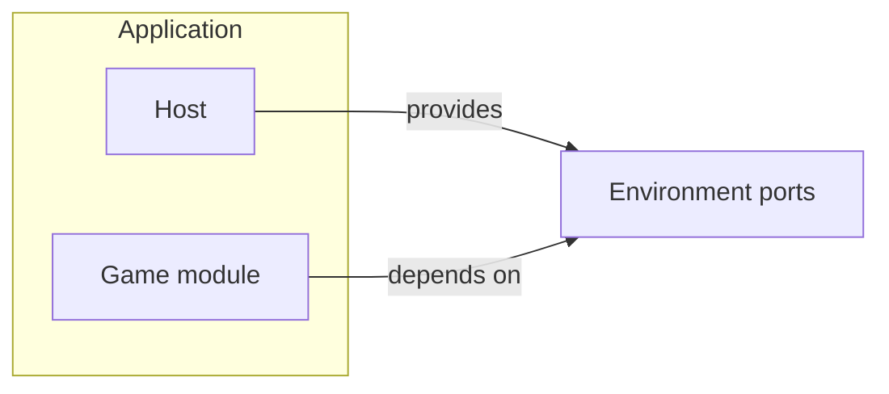
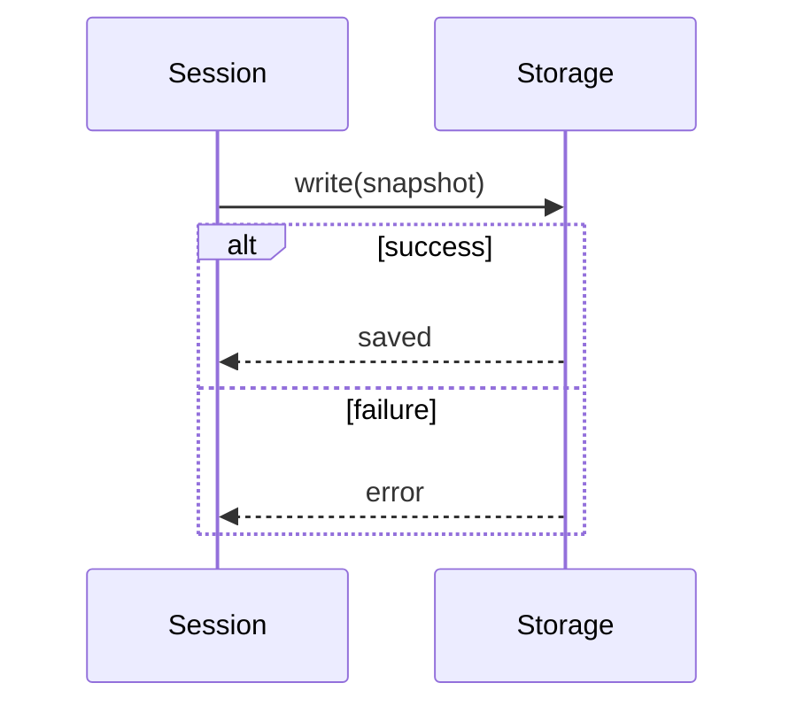
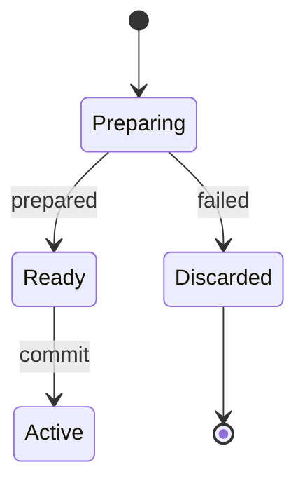
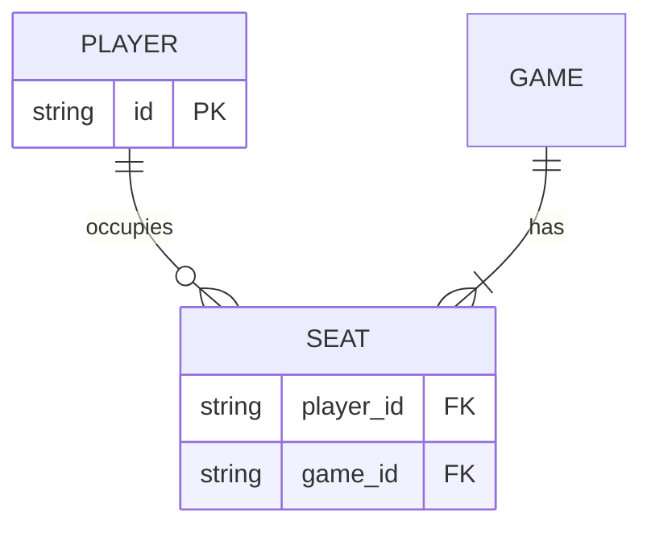

# Mermaid

Use Mermaid when the project chose it or the documentation host renders Mermaid fences natively. Selection: [selection.md](selection.md). Browser rendering inside a web artifact belongs to `playground`.

## Contents

- [Source rules](#source-rules)
- [Flowchart](#flowchart)
- [Sequence](#sequence)
- [State](#state)
- [ER](#er)
- [Relationship grammar](#relationship-grammar)
- [Local compilation](#local-compilation)
- [Limits and escalation](#limits-and-escalation)

## Source rules

- Stable IDs with bracketed labels: `orders[Order service]`. Edges reference IDs.
- `accTitle` and `accDescr` in every diagram type that supports them; they become the SVG title and description.
- Subgraphs only for real containment, ownership, trust, or deployment scope.
- Prefer the stable diagram types: `flowchart`, `sequenceDiagram`, `stateDiagram-v2`, `erDiagram`. Check newer types in the actual host before relying on them.
- Coordinates and routing belong to the layout engine; do not fight it with invisible nodes.

## Flowchart



Compact variant: the same source with `flowchart TB`.

## Sequence



`->>` is a call, `-->>` a reply. Use `alt`, `opt`, `loop`, and `par` for real alternatives, options, repetition, and parallelism.

## State



Composite states with history, orthogonal regions, or entry/exit actions that matter → PlantUML.

## ER



Cardinality markers are facts: `||` exactly one, `|o` zero or one, `}|` one or more, `}o` zero or more.

## Relationship grammar

| Meaning | Mermaid |
|---|---|
| direct call, dependency, transition, primary flow | `-->|verb|` |
| asynchronous event, reply, indirect influence | `-.->|verb|`, or `-->>` in a sequence |
| constraint, annotation, non-flow association | `-.-|verb|` |
| failure or forbidden path | an explicit failure verb or status word; color only as a secondary cue |

Use one meaning per line style within a diagram.

## Local compilation

With the Mermaid CLI installed in the project (`@mermaid-js/mermaid-cli`):

```bash
mmdc -i docs/diagrams/module-map.mmd -o docs/diagrams/module-map.light.svg -t default -b transparent
mmdc -i docs/diagrams/module-map.mmd -o docs/diagrams/module-map.dark.svg -t dark -b transparent
```

The CLI drives a headless browser; pin its version with the project's other dev dependencies. Check the exit status. A parse error must not leave a stale SVG in place.

## Limits and escalation

Move to another notation only after hitting a concrete limit the view needs: ports on specific node sides, field-level ER links, UML activation or composite state semantics, controlled layered layout of an extracted graph, or manual layout constraints. Keep the same model; do not maintain a Mermaid copy beside the new source.

[Mermaid syntax reference](https://mermaid.js.org/intro/syntax-reference.html) · [Accessibility options](https://mermaid.js.org/config/accessibility.html) · [Mermaid CLI](https://github.com/mermaid-js/mermaid-cli)
