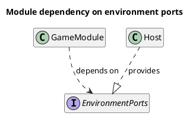
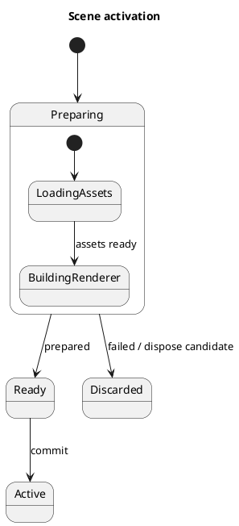

# PlantUML

Use PlantUML when the project chose it, or when a view needs UML semantics the primary language cannot state. Keep the primary language for the project's other views. Selection: [selection.md](selection.md).

## Preserve UML meaning

Pick the UML diagram the question needs: sequence, class, state, activity, component, deployment. Keep the constructs that carry meaning in the model: activation spans, `alt`/`par`/`loop` fragments, guards, composition versus aggregation, multiplicities, composite states with history, orthogonal regions. Do not flatten them into plain arrows to match another language.





## Local compilation

Use the project's installed PlantUML (JAR or package) and its version's flags. Current releases document GNU-style options (`--svg`, `--pipe`); the older single-dash forms (`-tsvg`) are kept for a transition period but are no longer documented:

```bash
java -jar tools/plantuml.jar --svg docs/diagrams/scene-activation.puml
java -jar tools/plantuml.jar --svg --pipe < docs/diagrams/scene-activation.puml > docs/diagrams/scene-activation.light.svg
```

Check the exit status (200 means some diagrams had syntax errors) and look at the output: by default PlantUML still renders syntax errors as an image, and `--no-error-image` turns that off. Some diagram types need Graphviz; others use internal layout engines. Install only what the selected view needs.

Generate the dark variant from the same `.puml` through shared skin parameters or a theme selected per build target. Compile locally; do not send architecture source to a public PlantUML server to avoid installing the tool.

[Notation](https://plantuml.com/) · [Command line](https://plantuml.com/command-line) · [Layout engines](https://plantuml.com/layout-engines)
