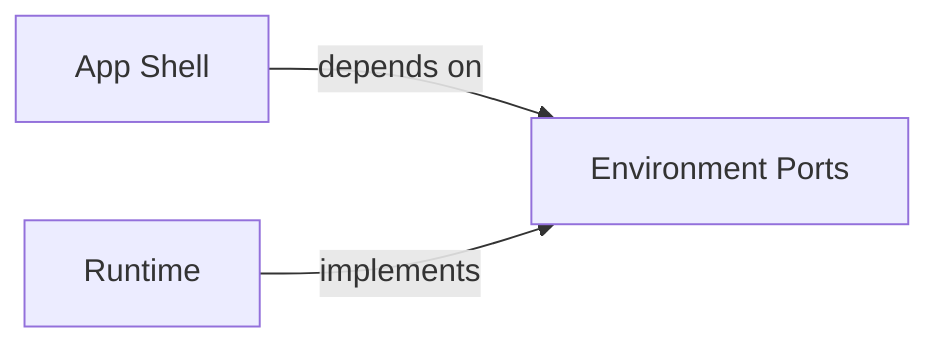

# Renderer Selection

## Contents

- [Boundary](#boundary)
- [Decision tree](#decision-tree)
- [Renderer map](#renderer-map)
- [Architecture handoff](#architecture-handoff)
- [Mermaid rendering contract](#mermaid-rendering-contract)
- [Responsive contract](#responsive-contract)
- [Escalation beyond Mermaid](#escalation-beyond-mermaid)
- [Failure modes](#failure-modes)

## Boundary

Choose a renderer after the source owner has selected the question and projection. A renderer lays out and presents meaning; it does not decide architecture, replace editorial structure, or turn every piece of content into a diagram.

Mermaid is the default renderer for maintainable architecture diagrams with standard graph semantics. It is not the page shell, content model, chart system, code viewer, or universal responsive layer.

## Decision tree

```text
What must the reader inspect?
├── architecture topology or behavior
│   Does a standard diagram grammar express it?
│   ├── flow, dependency, hierarchy with edges -> Mermaid flowchart
│   ├── participants over time -> Mermaid sequence
│   ├── lifecycle validity -> Mermaid state
│   ├── entity relationships -> Mermaid ER
│   └── no -> semantic HTML or a specialized renderer justified by the topology
├── containment or ownership without consequential edges
│   └── semantic HTML boundary/tree
├── exact comparison, inventory, or prose
│   └── HTML table, list, callout, or details
├── quantity, distribution, or uncertainty
│   └── chart grammar using SVG, canvas, or an established chart library
├── exact implementation or textual change
│   └── semantic code or diff view
└── migration stages or paired steady states
    └── HTML timeline and aligned current/target views; embed Mermaid only inside a stage that needs topology
```

Use Mermaid because the relationship grammar fits, not merely because the source is architectural.

## Renderer map

| View or content | Default renderer | Why | Compact alternative |
|---|---|---|---|
| system context with directed relations | Mermaid flowchart with subgraphs | automatic node and edge layout | vertical Mermaid or relationship list |
| module/component dependencies | Mermaid flowchart | labelled directed edges and groups | filtered graph or relationship list |
| process and decisions | Mermaid flowchart | branches, joins, terminal outcomes | top-to-bottom Mermaid |
| runtime collaboration | Mermaid sequence | participants, order, replies, alternatives | dense HTML message log |
| lifecycle | Mermaid state | transitions, guards, terminal states | vertical state view or transition list |
| logical data model | Mermaid ER | entities, attributes, cardinality | stacked entities plus textual cardinality |
| data movement and authority | Mermaid flowchart with real trust/authority subgraphs | sources, transformations, reads, writes | vertical Mermaid or relationship list |
| deployment path | Mermaid flowchart when connections dominate; HTML boundaries when placement dominates | topology and operational zones need different emphasis | vertical zones and path |
| containment-only hierarchy | semantic HTML tree or nested boundaries | no edge routing is needed | indented tree |
| ownership cards without cross-boundary flow | semantic HTML boundaries | preserves readable content and natural reflow | stacked boundaries |
| migration/evolution | HTML timeline and paired views | phase and status matter more than graph routing | vertical timeline |
| comparison or exact inventory | HTML table/matrix | alignment and exact wording | labelled row blocks |
| quantitative chart | focused SVG/canvas/chart library | scale, position, length, and uncertainty | simplified labels or small multiples |
| code and diff | semantic HTML `pre`/`code` | selectable exact evidence | local scroll and unified diff |
| navigation, themes, prose, disclosure | shared HTML shell | document structure, not diagram topology | collapsed menu and stacked content |

## Architecture handoff

When `architecture` selects a Mermaid-compatible view, keep the editable source in the architecture Markdown document:

````markdown

````

The surrounding architecture text owns:

- question, scope, abstraction level, and current/target status;
- authoritative node names, boundaries, relationship direction, and labels;
- fact, inference, proposal, and unknown status;
- one-sentence takeaway and a concise textual equivalent.

Visualization consumes that Mermaid definition as canonical diagram source. It may apply theme variables, an equivalent layout direction, disclosure, or a compact projection, but it must not silently add nodes, rename concepts, reverse relationships, or resolve an architectural contradiction.

## Mermaid rendering contract

Use stable IDs separate from display labels. Prefer broadly supported flowchart, sequence, state, and ER syntax; verify newer diagram types in the actual target renderer.

For every diagram:

- include accessible title and description syntax when supported;
- label consequential edges with verbs;
- use subgraphs only for real containment, ownership, trust, or deployment scope;
- keep status words explicit rather than encoding them only through color;
- leave coordinates and connector routing to the layout engine;
- keep styling minimal and map it from the shared visual tokens at render time;
- preserve the Mermaid source as text instead of treating generated SVG as the source of truth.

Do not hand-edit Mermaid's generated SVG. Re-render from source after a model, theme, or layout change.

For flowcharts, architecture may attach this portable semantic class vocabulary when category is part of the decision: `external`, `system`, `interface`, `domain`, `data`, and `risk`. The HTML renderer maps those classes to the shared light/dark tokens. Keep sequence, state, and ER diagrams neutral unless category color carries necessary meaning; their native notation already communicates the primary structure.

Map the shared relationship grammar deliberately:

| Meaning | Mermaid treatment |
|---|---|
| direct call, dependency, transition, or primary flow | solid directed link such as `-->|verb|` |
| asynchronous event, reply, or indirect influence | dashed directed link such as `-.->|verb|` or the native dashed sequence reply |
| constraint, annotation, or non-flow association | dotted link without a strong arrow such as `-.-|verb|` |
| failure or forbidden path | explicit failure verb/status plus a `risk` target or native failure branch; color is secondary |

Do not reuse a dashed arrow for both an event and a constraint in the same artifact.

## Responsive contract

Mermaid solves graph layout, not responsive meaning. Choose among these in order:

1. render the same source in a compact-friendly direction when that preserves semantics;
2. filter or aggregate secondary nodes while keeping identities and status explicit;
3. provide a separate compact projection over the same model, such as a message log or relationship list;
4. allow labelled local scrolling only when reflow would falsify topology.

Do not scale a complex SVG until labels become unreadable. A desktop Mermaid diagram and its compact HTML alternative must preserve the same nodes, relationships, order, cardinality/optionality, failure paths, and status. Treat the Mermaid source or upstream render model as canonical. Before delivery, compare every compact relationship row against it by stable source, target, kind, label, and status; a hand-maintained compact projection is unfinished until that parity check passes.

## Escalation beyond Mermaid

Add a specialized graph renderer only after a reproduced Mermaid limitation affects a required view. Typical evidence includes ports on specific node sides, incremental layout, coordinated selection across a large graph, manual layout constraints, or topology-specific interaction Mermaid cannot express.

Keep the same render model and shell when escalating. Do not introduce a second source of architectural truth merely to gain a different renderer.

## Failure modes

- **Mermaid page model** — shell, prose, tables, and evidence are forced into diagram nodes.
- **Architecture by renderer** — supported Mermaid syntax determines the system design.
- **Generated-SVG source** — edited SVG drifts from the architecture Markdown.
- **CSS graph engine** — branching, routing, loops, or ports are rebuilt with borders and absolute positions.
- **Scaled mobile poster** — a correct desktop diagram becomes unreadable on compact width.
- **Duplicate truth** — desktop Mermaid and compact HTML describe independently maintained models.
- **Premature specialized engine** — a larger dependency is added before a concrete Mermaid limitation is reproduced.
